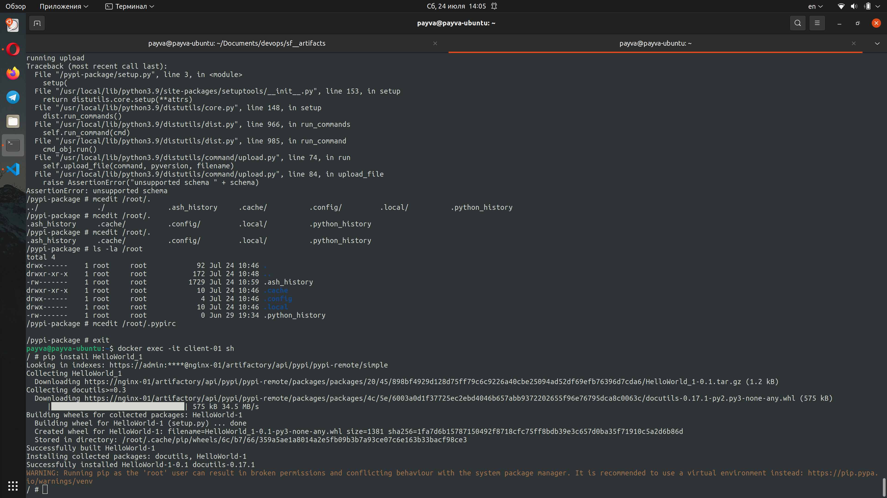
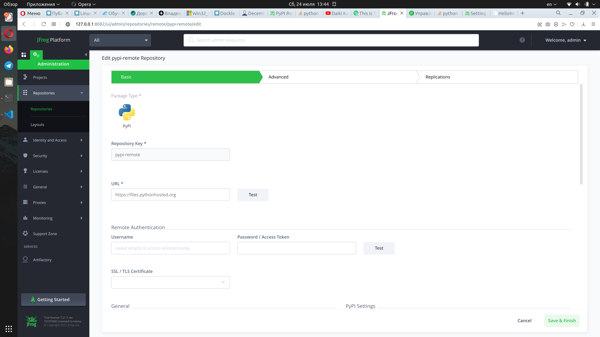
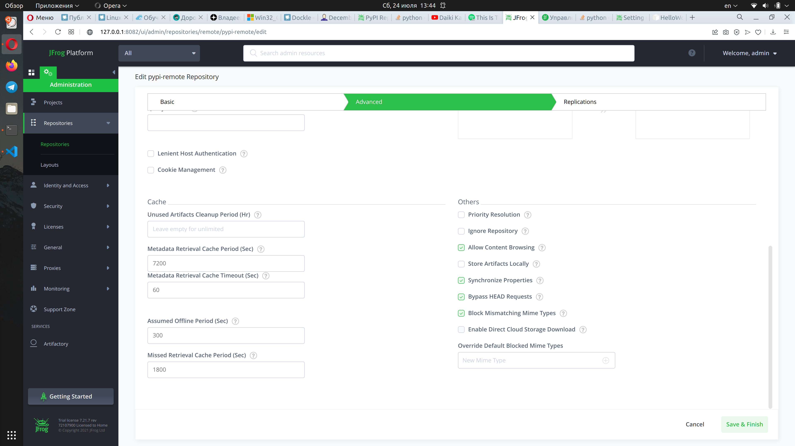
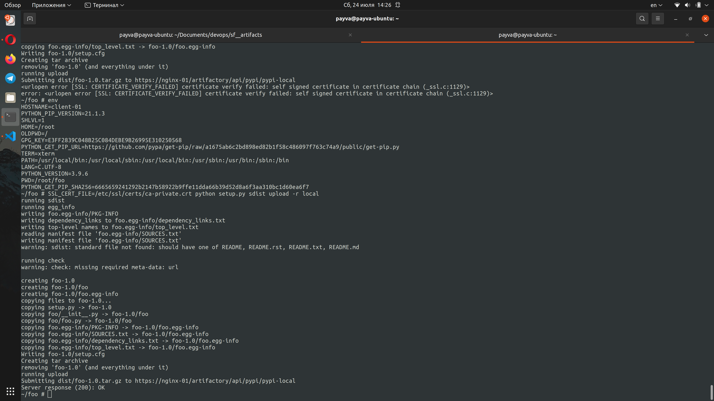
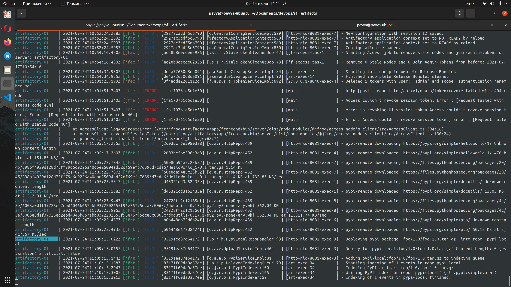
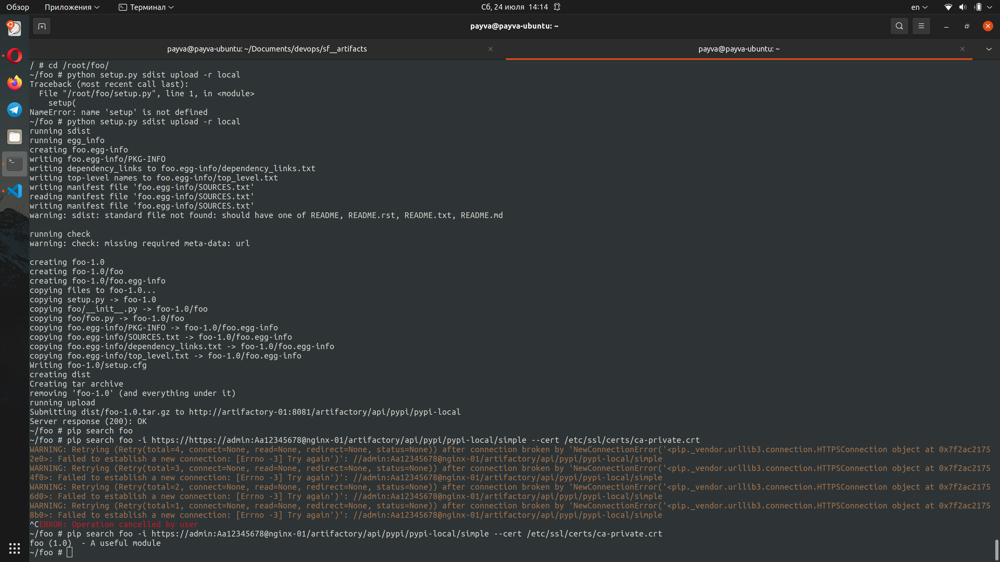

# SkillFactory: DEVOPS. Проектная работа 4 и 5

## Задание проектной работы 4

1) Используя Я.Облако, создать виртуальную машину (операционную систему выберите на свое усмотрение, рекомендуемое минимальное количество ресурсов: 4 vCPU, 4GB RAM, 50GB HDD).
1) Развернуть (используя бесплатный пробный период) Artifactory.
1) Настроить на Artifactory проксирование pip-репозитория pipy.org.
1) Предоставить разработчикам репозиторий для публикации результатов разработки.
1) Отправить ментору конфигурационный файл pip.conf, настроенный для работы с Artifactory в качестве репозитория (вместо стандартного pipy.org), и ссылку на Artifactory, развернутую на вашей машине. Интерфейс должен быть доступен из интернета.

## Задание проектной работы 5

1) Создайте в Я.Облаке виртуальную машину под управлением Linux. Это будет ВМ для УЦ.
1) Создайте новую внутреннюю доменную зону (используя Yandex Cloud DNS), затем добавьте в эту зону новую DNS-запись, указывающую на машину с Artifactory. Доменное имя используйте любое на свое усмотрение.
1) На ВМ для УЦ создайте корневой и серверный сертификат для вашей машины (для выбранного вами доменного имени).
1) Настройте Artifatory на использование SSL и созданного вами сертификата. (Выбирайте любой из вариантов: настройка SSL на TomCat, работающем с Artifactory веб-сервере, либо настройка связки nginx+Artifactory).
1) Создайте еще одну машину в Я.Облаке, теперь под управлением Windows. Она потребуется для проверки выполнения задания.
1) Установите созданный вами корневой сертификат на вашу ВМ под управлением Windows. (Созданное выше доменное имя будет работать только на машинах из Я.Облака, поэтому проверить настройки с помощью своего ноутбука не выйдет).
1) С помощью веб-браузера зайдите (по HTTPS-протоколу) на машину, где развернут Artifactory, и убедитесь, что соединение защищено.
1) Отправьте ментору скриншот с подтверждением защищенного соединения, доменное имя вашей машины и порт, на котором работает Artifactory.

## Решение

Для решения задачи создан docker-compose файл который разворачивает

- Artifactory для обеспечения работы репозитория
- Nginx в режиме обратного прокси для обеспечения ssl соединения
- Клиент для работы с репозиторием

Перед применением можно выполнить следующие действия:

1) Перегенерировать сертификаты 
    * перейти в каталог openssl
    * удалить все файлы из директории openssl кроме run.sh и openssl.conf
    * запустить ./run.sh для генерации новых сертификатов
1) Сменить пароли в следующих файлах:
    * client/pip.conf
    * client/.pypirc
1) Получить лицензионный файл Artifactory

После запуска выполнить следующие действия

1) Установить пароль администратора Artifactory из конфигурационных файлов 
1) Создать в Artifactory локальный pypi репозиторий pypi-local
1) Создать в Artifactory удаленный pypi репозиторий pypi-remote и задать ему настройки (см скриншоты ниже)

## Результат

Проксирование репозитория через ssl соединение: 

Загрузка пакета в репозиторий через ssl соединение:

